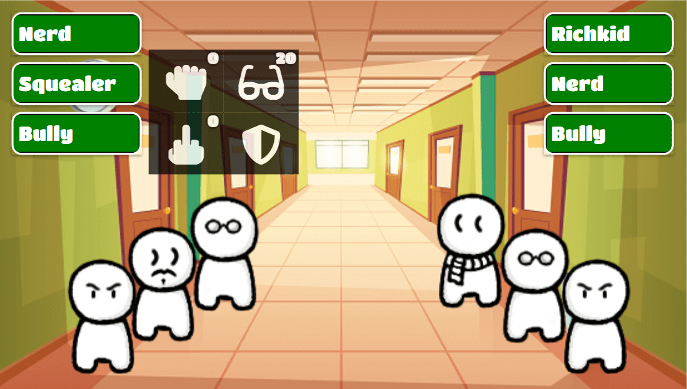

# School Fight

## About

School Fight is a turn based fighting game. Choose your party and battle it out in 3vs3 fights to become king of school!
There are three types of characters: strength, intelligence and assholiness. The mechanics work by a rock paper scissors principle: 
strength is effective against intelligence, intelligence is effective against assholiness and assholiness is effective against strength
All characters (including the opponent party) attack at the same time. This gives the fights a unique dynamic.
Use items to deal damage or repleanish your health. Beat all nine levels including two mini games and a boss battle.

## How to play

Open index.html to start the game. Choose three characters for your party. Click on a character. Select a type of attack and an opponent to attack. Do this for all your party members. Alternatively set a character on defending to reduce taken damage next turn. To control minigames you need to click on the screen. To use an item simply click one of the icons on the bottom of the screen. The sandwich recovers health for your whole party. The bomb damages all opoonents. The more of your characters survive a fight, the more items you can obtain.

## Used Technologies

The game is written in Javascript/jQuery using mainly regular HTML and CSS for displaying graphics.
